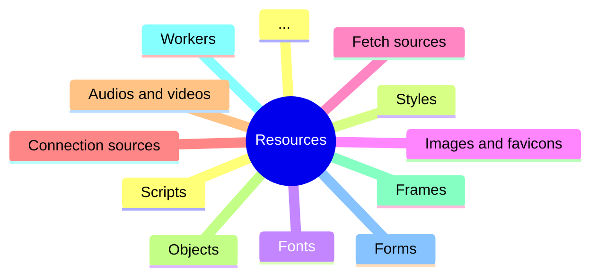
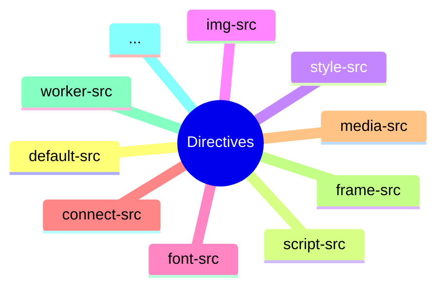
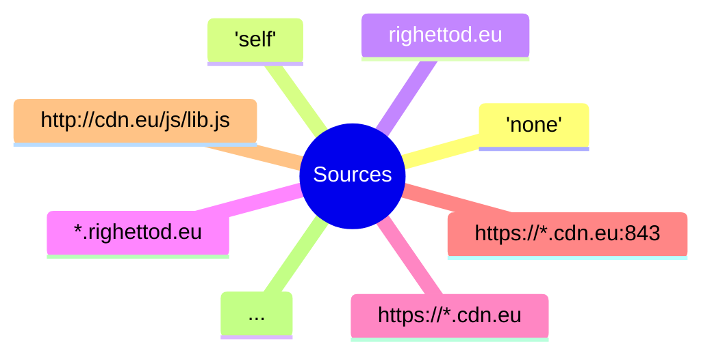

# Description

Contains the schemas used into the presentation.

💻 [Editor used](https://mermaid.live/).

# Mermaid code

## CSP controlled resources

```mermaid
mindmap
  root((Resources))
    Scripts
    Styles
    Fonts
    Images and favicons
    Fetch sources
    Connection sources
    Audios and videos
    Objects
    Frames
    Workers
    Forms
    ...
```

## CSP directives

```mermaid
mindmap
  root((Directives))
    default-src
    script-src
    style-src
    img-src
    font-src
    connect-src
    media-src
    frame-src
    worker-src
    ...
```

### CSP sources

```mermaid
mindmap
  root((Sources))
    'none'
    'self'
    righettod.eu
    *.righettod.eu
    https://*.cdn.eu
    https://*.cdn.eu:843
    http://cdn.eu/js/lib.js
    ...
```
