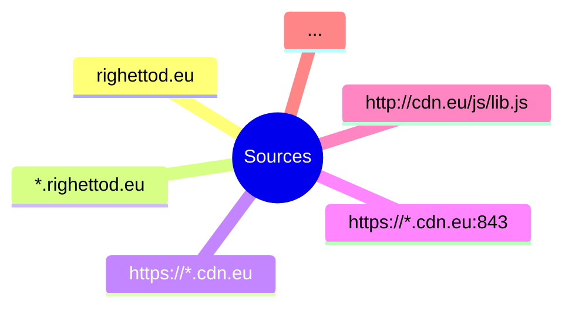
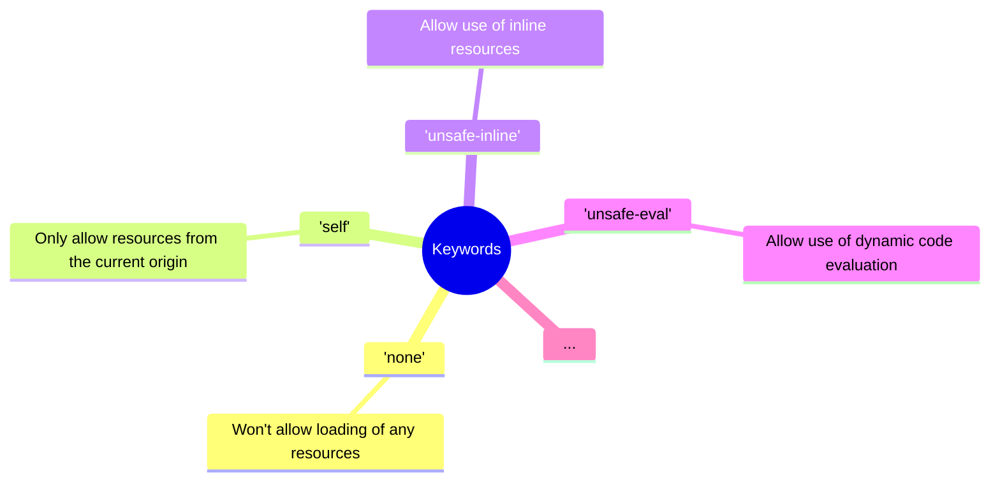

# Description

Contains the schemas used into the presentation.

💻 [Editor used](https://mermaid.live/).

# Mermaid code

## CSP controlled resources

## CSP directives

### CSP sources

### CSP keywords

